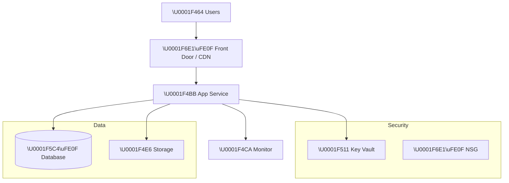

# 🏛️ Step 2: Architecture Assessment - {project-name}

📑 Assessment Contents

- [✅ Requirements Validation](#-requirements-validation)
- [💎 Executive Summary](#-executive-summary)
- [📦 Resource SKU Recommendations](#-resource-sku-recommendations)
- [🎯 Architecture Decision Summary](#-architecture-decision-summary)
- [🚀 Implementation Handoff](#-implementation-handoff)
- [🔒 Execution Handoff](#-execution-handoff)
- [References](#references)

---

### Recommended Architecture

> Replace the above with actual architecture for the project.

---

## 📦 Resource SKU Recommendations

| Service   | Recommended SKU | Configuration |
| --------- | --------------- | ------------- |
| {service} | {sku}           | {config}      |

---

## 🎯 Architecture Decision Summary

| Decision   | Choice | Rationale |
| ---------- | ------ | --------- |
| Decision 1 |        |           |
| Decision 2 |        |           |

---

## 🚀 Implementation Handoff

### Ready for bicep-plan

The architecture is ready for implementation with the following key parameters:

| Parameter      | Value    |
| -------------- | -------- |
| Region         | {region} |
| Environment    | {env}    |
| Resource Count | {count}  |

### Resources to Provision

| #   | Resource   | SKU   | Key Config |
| --- | ---------- | ----- | ---------- |
| 1   | {resource} | {sku} | {config}   |
| 2   | {resource} | {sku} | {config}   |

---
