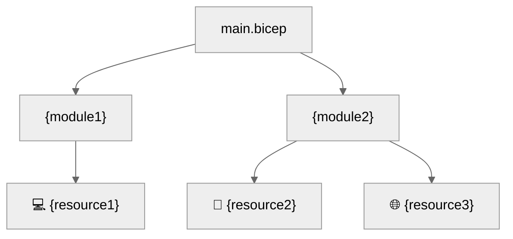

# 💻 Step 5: Implementation Reference - {project-name}

📑 Implementation Reference

- [📁 IaC Templates Location](#-iac-templates-location)
- [🗂️ File Structure](#-file-structure)
- [✅ Validation Status](#-validation-status)
- [🏗️ Resources Created](#-resources-created)
- [🚀 Deployment Instructions](#-deployment-instructions)
- [📝 Key Implementation Notes](#-key-implementation-notes)

## 📁 IaC Templates Location

📁 **Code Location**: [`infra/`](./infra/)

## 🗂️ File Structure

```text
generated-scenarios/{project-name}/infra/
├── main.bicep              # Main orchestration template
├── main.bicepparam         # Parameter file
└── modules/
    └── {module}.bicep      # Resource modules
```

## ✅ Validation Status

| Check         | Result       | Details                    |
| ------------- | ------------ | -------------------------- |
| `bicep build` | ✅ / ❌      | {details or error message} |
| `bicep lint`  | ✅ / ⚠️ / ❌ | {details or warning count} |
| `what-if`     | ✅ / ❌      | {resource count or error}  |

## 🏗️ Resources Created

| Resource   | Bicep Type   | Module   |
| ---------- | ------------ | -------- |
| {resource} | {bicep-type} | {module} |



> Replace with actual module and resource names from generated Bicep.

## 🚀 Deployment Instructions

```bash
# Deploy with azd
cd generated-scenarios/{project-name}
azd up
```

```bash
# Preview changes (What-If) before deploying
azd provision --preview
```

## 📝 Key Implementation Notes

| Note                                                 | Impact             | Reference     |
| ---------------------------------------------------- | ------------------ | ------------- |
| Unique suffix via `uniqueString(resourceGroup().id)` | All resource names | main.bicep    |
| {additional note}                                    | {impact area}      | {module/file} |

```bicep
var uniqueSuffix = uniqueString(resourceGroup().id)
// Example: {resource-prefix}-{suffix}
```

{additional-implementation-notes}

---
