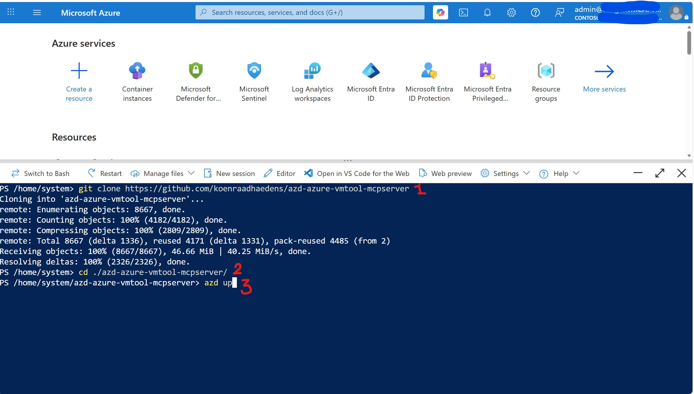
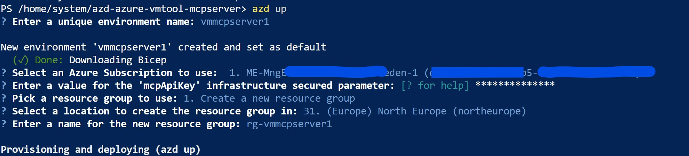
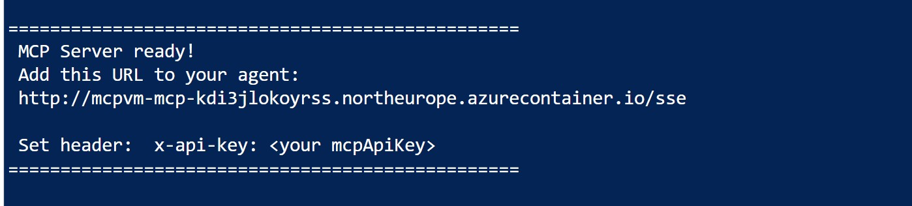
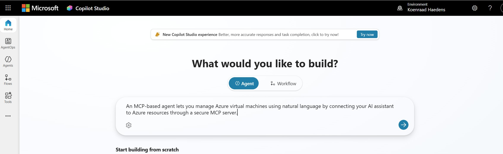
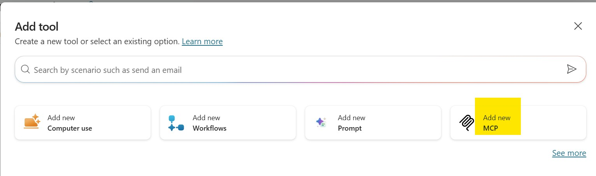
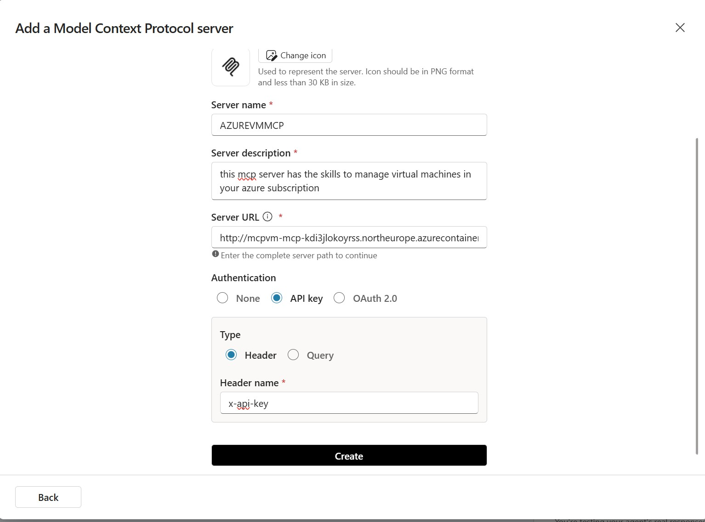
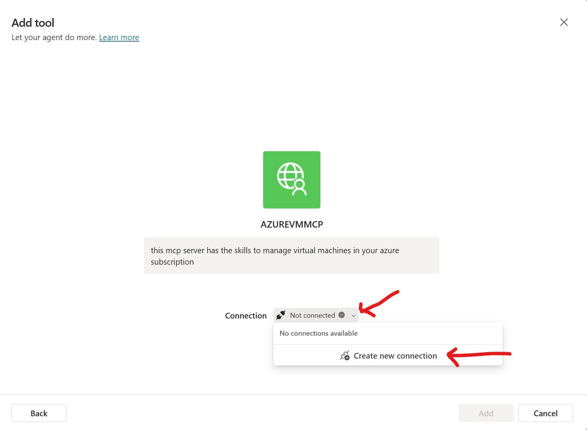
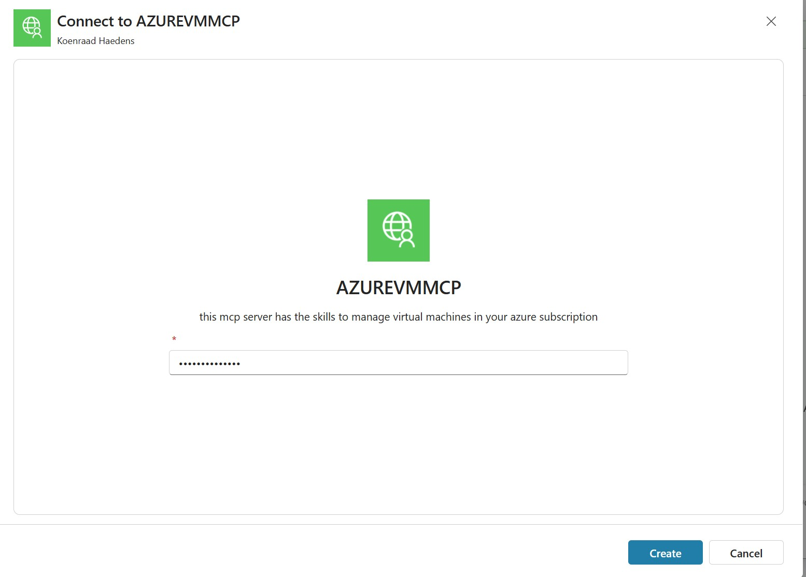
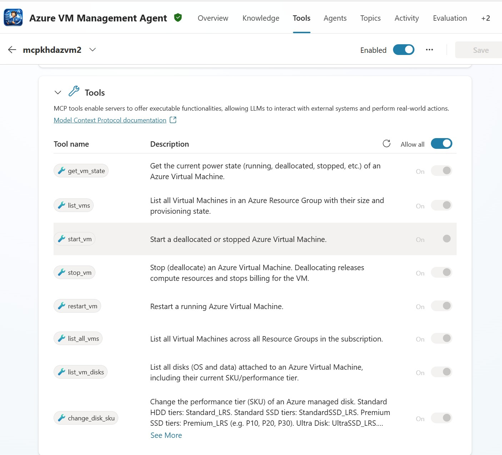
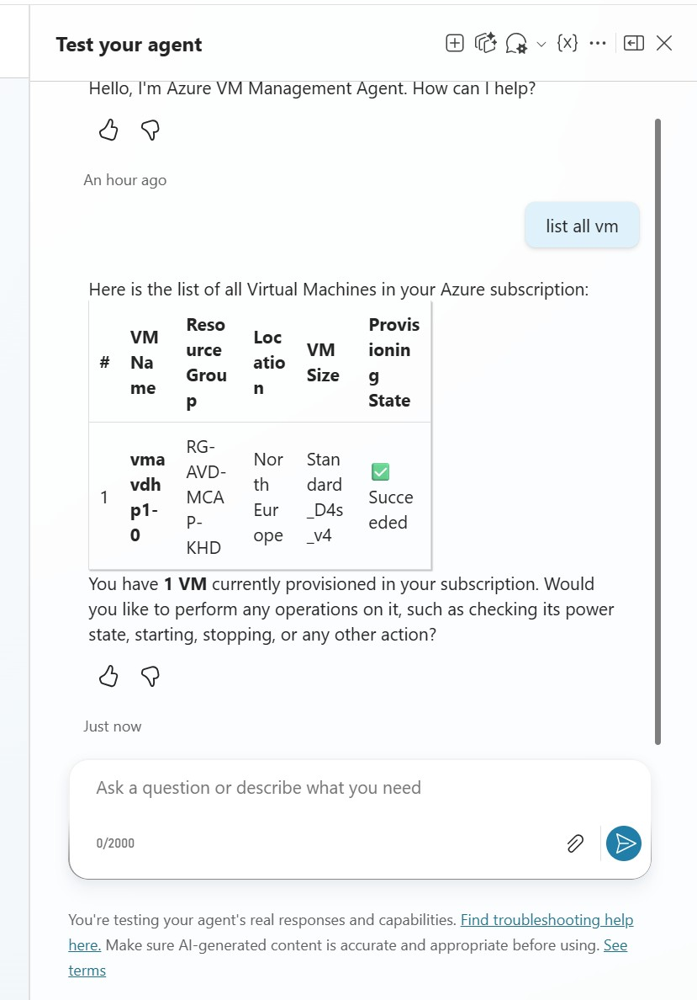

# Demo Guide: Deploy and Configure the Azure VM Tool MCP Server

This guide walks through deploying the MCP server using Azure Cloud Shell and then connecting it to a Microsoft Copilot Studio agent.

> **Important demo-only security note**  
> This guide uses an **HTTP** MCP server URL because the deployment is intended for a demo scenario. **HTTP is not recommended for production.** For production environments, use HTTPS/TLS, proper authentication, and secure secret management.

---

## Prerequisites

- Access to Microsoft Azure
- Azure Cloud Shell (PowerShell or Bash)
- Access to Microsoft Copilot Studio
- Permissions to create resources in an Azure subscription

---

## Part 1 – Deploy the MCP Server

---

## Step 1 – Clone the Repository

Run the following command in Azure Cloud Shell to download the project:

```bash
git clone https://github.com/koenraadhaedens/azd-azure-vmtool-mcpserver
```

---

## Step 2 – Navigate to the Project Folder

Change into the newly created directory:

```bash
cd ./azd-azure-vmtool-mcpserver/
```

---

## Step 3 – Start the Deployment

Initiate the deployment using AZD:

```bash
azd up
```

> The screenshot below shows all three commands (① clone, ② cd, ③ azd up) entered in Cloud Shell.



---

## Step 4 – Provide Deployment Inputs

During execution, AZD prompts for several values:

- Environment name (must be unique)
- Azure subscription selection
- `mcpApiKey` (secured parameter)
- Resource group creation
- Azure region (for example: North Europe)

Example values visible in the screenshot:

- Environment: `vmmcpserver1`
- Resource group: `rg-vmmcpserver1`
- Region: `northeurope`



---

## Step 5 – Deployment in Progress

AZD will:

- Download dependencies (for example Bicep)
- Provision Azure resources
- Deploy the MCP server to Azure Container Instance

No action is required during this phase.

---

## Step 6 – Deployment Complete

After successful deployment, the output confirms the MCP server is ready and displays the endpoint URL.

Copy the URL shown — you will need it in the next part.



---

## Part 2 – Create a Copilot Studio Agent and Add the MCP Server

---

## Step 7 – Create a New Agent in Copilot Studio

1. Open **Microsoft Copilot Studio**.
2. From the left navigation, select **Home** or **Agents**.
3. Choose to create a new **Agent**.
4. In the agent description box, describe what the agent should do. Example:

```text
An MCP-based agent lets you manage Azure virtual machines using natural language by connecting your AI assistant to Azure resources through a secure MCP server.
```

5. Continue with the agent creation flow.



---

## Step 8 – Add a New MCP Tool

1. Open the newly created agent.
2. Go to the **Tools** section.
3. Select **Add tool**.
4. In the **Add tool** dialog, choose **Add new MCP**.



---

## Step 9 – Configure the MCP Server

In the **Add a Model Context Protocol server** screen, fill in the following details:

| Field | Example value |
|---|---|
| Server name | `AZUREVMMCP` |
| Server description | `This MCP server has the skills to manage virtual machines in your Azure subscription.` |
| Server URL | The `http://` URL from the `azd` deployment output (Step 6) |
| Authentication | `API key` |
| Type | `Header` |
| Header name | `x-api-key` |

After entering all details, select **Create**.



---

## Step 10 – Create a Connection

After the MCP server is saved, Copilot Studio asks you to set up a connection.

1. Open the **Connection** dropdown.
2. If no connection exists, select **Create new connection**.



---

## Step 11 – Enter the API Key

1. In the **Connect to AZUREVMMCP** screen, enter the `mcpApiKey` value you chose during deployment.
2. Select **Create**.



---

## Step 12 – Review and Enable MCP Tools

After the connection is established, Copilot Studio displays all tools exposed by the MCP server:

| Tool | Description |
|---|---|
| `get_vm_state` | Get the current power state of an Azure Virtual Machine |
| `list_vms` | List Virtual Machines in an Azure Resource Group |
| `start_vm` | Start a stopped or deallocated Virtual Machine |
| `stop_vm` | Stop/deallocate a Virtual Machine |
| `restart_vm` | Restart a running Virtual Machine |
| `list_all_vms` | List all Virtual Machines across all Resource Groups in the subscription |
| `list_vm_disks` | List disks attached to a Virtual Machine including performance tier |
| `change_disk_sku` | Change the performance tier/SKU of a managed disk |

Enable the tools you want to use. Select **Allow all** for the demo if appropriate.



---

## Step 13 – Test the Agent

Use the test pane in Copilot Studio to verify that the agent can call the MCP server.

Example prompt:

```text
list all vm
```

The agent will call the MCP server and return a table with all Virtual Machines in your subscription.



---

## Summary

```bash
git clone https://github.com/koenraadhaedens/azd-azure-vmtool-mcpserver
cd azd-azure-vmtool-mcpserver
azd up
```

Follow the prompts, wait for provisioning, copy the MCP endpoint URL from the output, then configure it in Copilot Studio as described in Part 2.

---

## Demo Validation Checklist

- [ ] The agent is created in Copilot Studio
- [ ] The MCP server is added as a new tool
- [ ] The `http://` MCP endpoint from `azd` output is entered as the server URL
- [ ] Authentication is set to **API key** with header name `x-api-key`
- [ ] A new connection is created successfully
- [ ] MCP tools are visible in the agent
- [ ] At least one VM-related tool can be called from the test pane

---

## Quick Troubleshooting

| Issue | What to check |
|---|---|
| Server URL is not accepted | Make sure you paste the complete URL including the `/sse` path |
| Connection cannot be created | Verify the API key matches the `mcpApiKey` you set during deployment |
| Tools do not appear | Confirm the MCP server container is running in the Azure portal |
| Agent cannot execute a tool | Check permissions, authentication, and MCP server logs |
| Demo works locally but not from Copilot Studio | Verify the MCP server endpoint is publicly reachable |

---

## Production Reminder

This demo uses an **HTTP** endpoint to simplify the demonstration. For production use:

- HTTPS/TLS encrypted communication
- Secure API key or secret rotation
- Managed identities or enterprise identity controls
- Network controls such as private endpoints or restricted ingress
- Logging and monitoring
